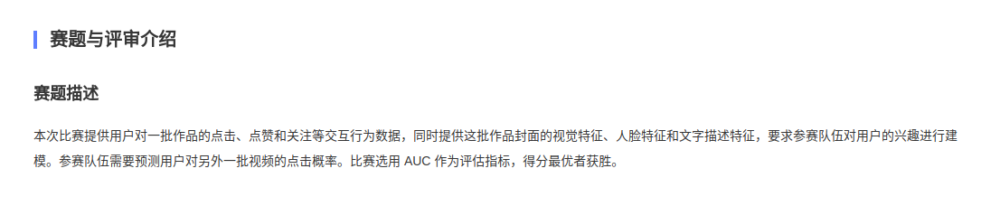
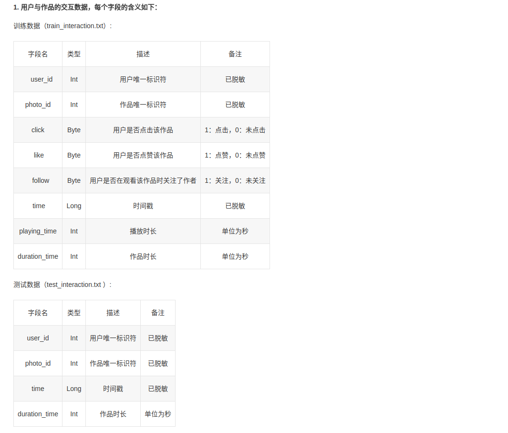
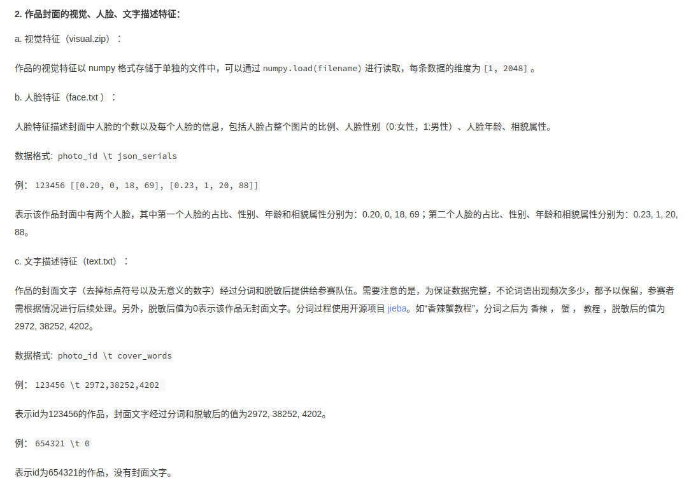
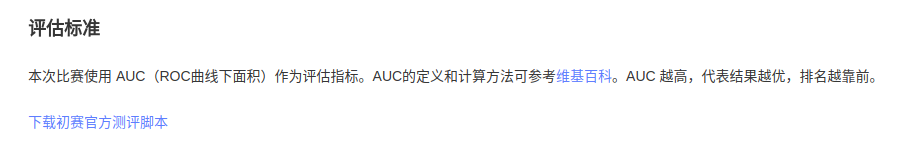

## contest info
- introduction

- dataset

- evaluation

## 项目组织结构
- **preprocessing_text_feature_embedding.py**. 构造作品的文本数据的embedding。
- **preprocessing_top_word_tfidf.py**. 利用IF-TDF算法，为作品的文本数据提取最具代表性单词。
- **preprocessing_photos.py**. 构造关于作品的examples，分别包含人脸，文本features。
- **preprocessing_user_preferences.py**. 构造关于用户的examples，features为用户对各种作品大类的评分。
- **modeling_k_means.py**. 利用K-Means模型对作品、用户进行聚类。
- **recommend_for_each_user.py**. 利用已训练的K-Means模型，预测用户点击率，保存预测结果到文件。
- **lr.py**. 利用sklearn的LR模型，对用户与作品的交互行为examples进行分类，输出概率作为点击可能性预测，保存预测结果到文件。
- **rf.py**. 利用sklearn的ensemble模型（RandomForestClassifier），自动化grid search挑选超参数，对交互行为examples进行分类，输出概率作为点击可能性预测，保存预测结果到文件。
- **nn.py**. 利用TensorFlow构建神经网络模型（3层neural network）， grid search方法挑选超参数，对交互行为examples进行分类，输出概率作为点击可能性预测，保存预测结果到文件。
- **nn5.py**. 利用TensorFlow构建神经网络模型（5层neural network）， grid search方法挑选超参数，对交互行为examples进行分类，输出概率作为点击可能性预测，保存预测结果到文件。
- **utils.py**. 辅助功能，包括记录日志。
- **all_in.py**. K-Means建模流程，从样例构造预处理一直到预测输出结果到文件的全流程。
- **evaluation_script.py**. 可验证预测输出文件是否符合要求，并根据输入的测试结果文件，计算AUC得分。

## 数据探查

### 数据源与隐藏规律，复赛数据是初赛的2.5倍左右
- train_interaction.txt
    - 5.2E7
    - 其中用户数为1.5E4
- train_face.txt
    - 3.0E6
    - 不是所有作品都有人脸数据
- train_text.txt
    - 7.6E6
    - 每个单词已编码
    - 所有的作品都有封面文字数据
- test_face.txt
    - 6.3E5
- test_text.txt
    - 1.6E6
- test_interaction.txt
    - 8.2E6
    - 待预测的用户都有交互历史
    - 用户数同*train_interaction.txt*

##策略：
###物以类聚，人以群分
作品分类：分K1类 belongs to [10, 100] (IMDB电影分类标签: 12, Youtube: 18)
- 输入特征：人脸 --> 文字 --> 图像
    - face features. <num_face, face_occu, gender_pref ([0, 1] 0 means all female, 1 means all male), age, looking
    - text features. a)Embedding b)TF-IDF
    - hot features. <show, click, like, follow>    
- 算法：K-means, autoencoder
- 输出model：<cate_id, cate_features, [photo_id: set]>  
<=> KMeans with <example_id, label> 

人分类：分K2类，K2  belongs to [K1, max(K1 + 1, min(1000, C(K1, 2)))] (三教九流, 千人千面) **考虑到用户数量少，所以可以不对用户分类**
- 输入example：<user_id, [interest_on_cate_id: fixed length]>
- 算法：K-means
- 输出model: <pop_id, pop_features, [user_id: set]>, pop: population, normalization with **MinMaxScaler** and cold-starting  
<=> KMeans with <example_id, label> 

预测：
- 为用户、作品归类：<user_id, photo_id> -> <pop_id, cate_id>
- 计算点击率：P{click} = pop_features[cate_id] mapped into [0, 1]
- 输出结果：<user_id, photo_id, click_probability>

###监督学习 v1.0.0
什么样的用户面对什么样的作品，出现点击或者不点击: <user_features, photo_features, click ({0 ,1})>
- 输入样例：历史交互数据
<user_id, photo_id, click> -> <user_id_count, user_click_oof, user_play_time_oof, duration_time, time, click>
- 扩展feature
    - 用户相关
        - user_id_count: 用户在训练集中出现的交互次数
        - user_click_oof: click per show. 每次展现，用户平均点击动作的发生频率
        - user_play_time_oof: play time per click. 每次点击后，播放的时长
    - 作品相关
        - duration_time
    - 交互相关
        - time: timestamp
    

- 模型：LR
- 预测：LR.predict_proba(X_test)[:, 1]

###监督学习 v2.0.0
- 扩展作品相关feature
    <user_click_oof, user_play_time_oof, duration_time, time, num_face, face_occu, gender_pref, age, looking, topic, click>
- 模型使用集成学习算法 + GridSearch调优

### 文字信息处理
- 常用汉语词汇量50000
- embedding维度128
- TF-IDF挑选最具代表性的一个单词

### 监督学习 v3.0.0
- NN modeling with mini-batch style in TF
- SGD optimization
- grid search for hyper-parameters tuning

### 监督学习 v4.0.0
- TODOs
    - classification --> regression 
    - text info --> context (前20%的单词的平均embedding)
    - visual info --> auto-encoder with low dimensions
    - true vs. false examples
    - users number
- features
    - user_click_oof, user_play_time_oof, duration_time, time, num_face, face_occu, gender_pref, age, looking, topic, click

